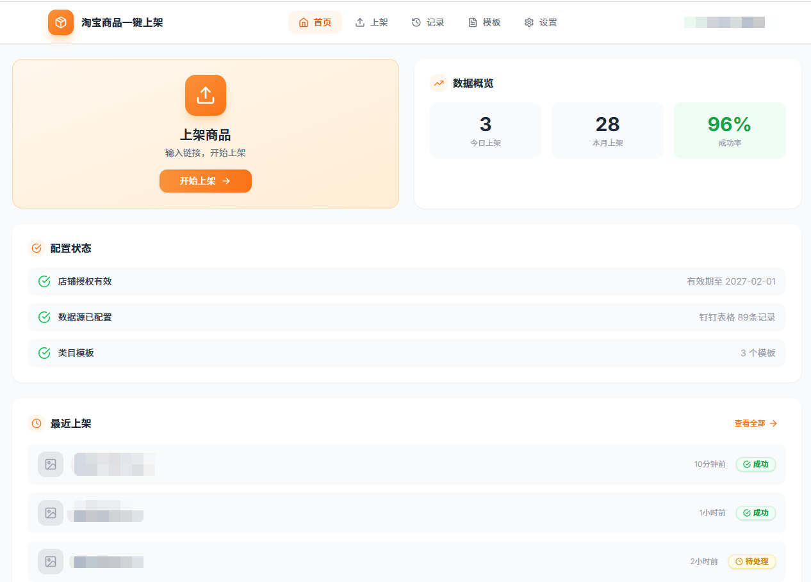
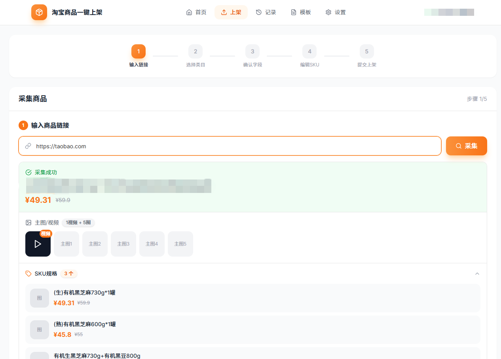
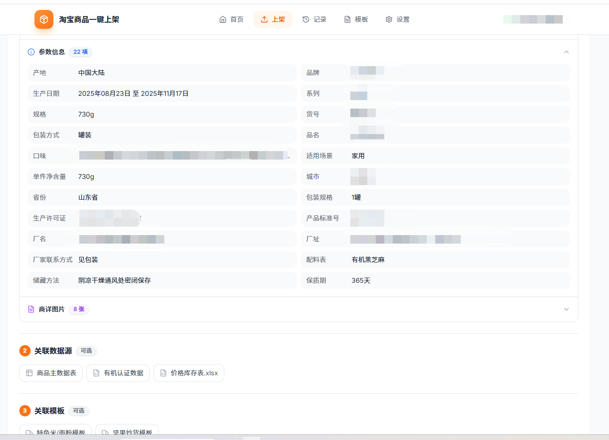
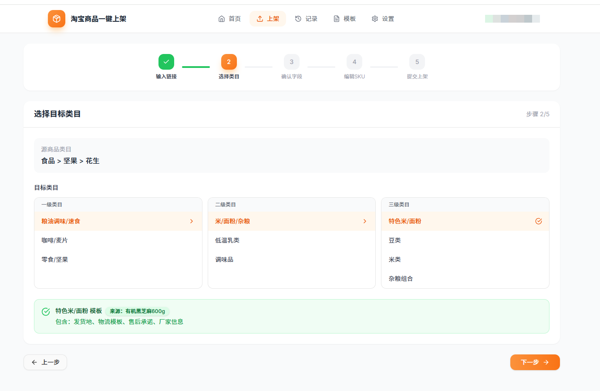
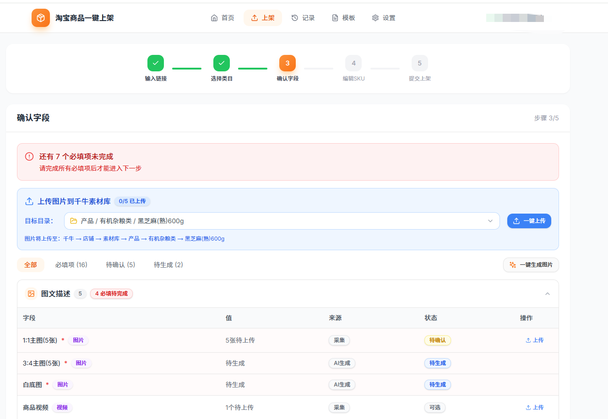
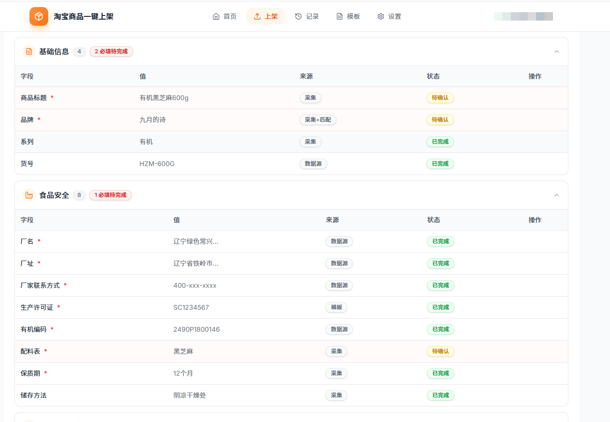
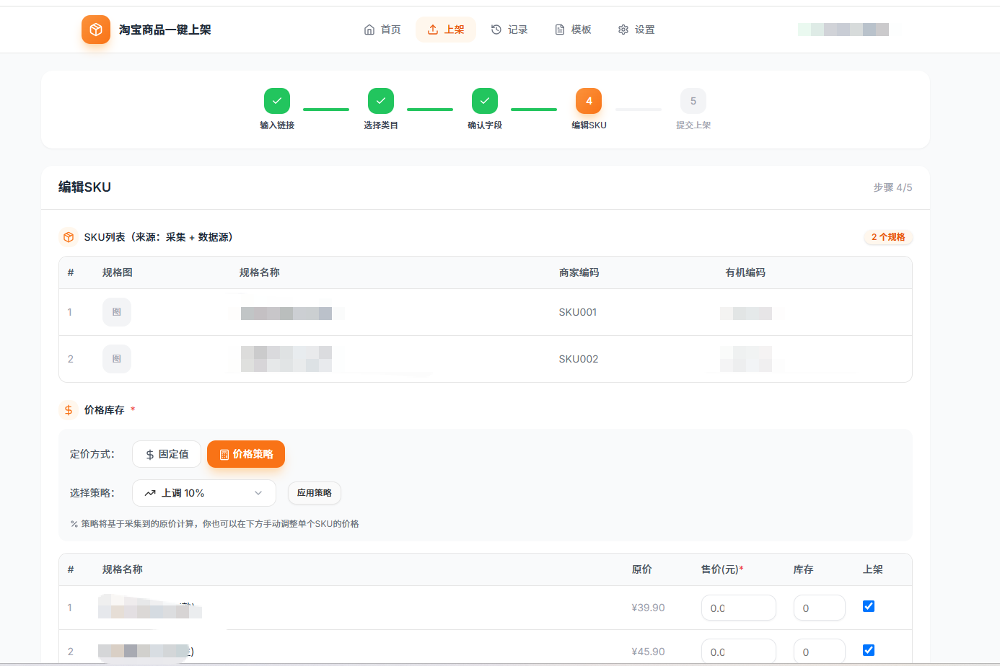
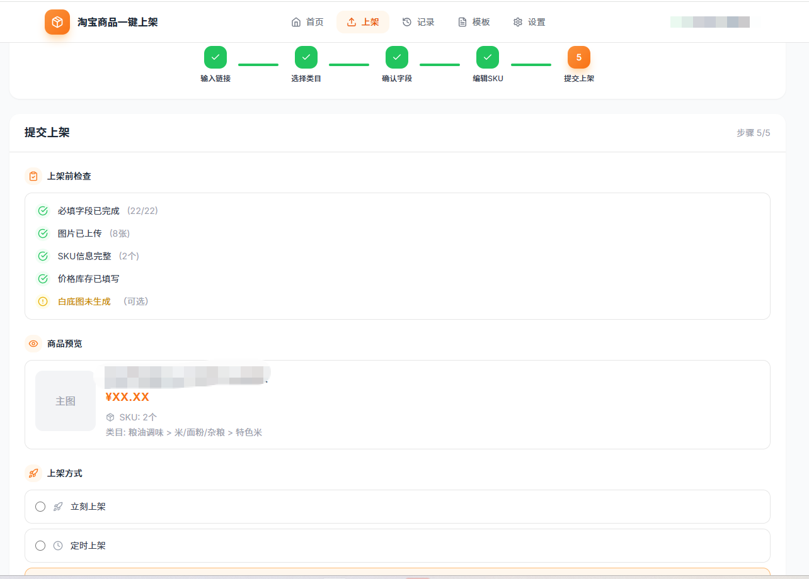
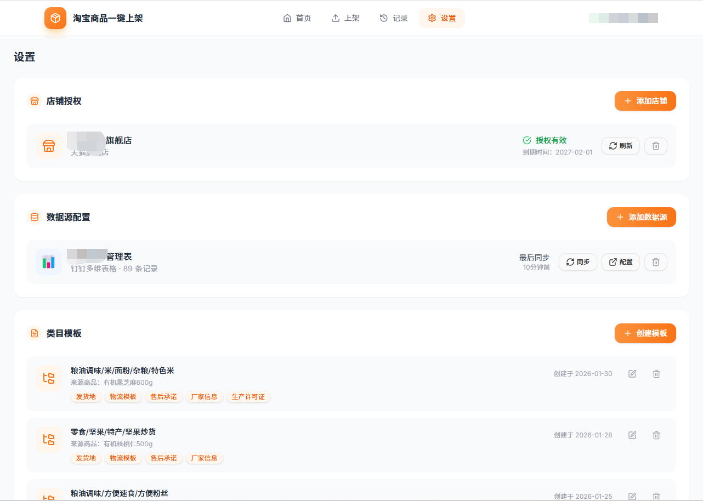

# 淘宝商品一键上架工具

帮助电商卖家快速复制商品到自己店铺的工具。

## 为什么需要这个工具？

### 目标用户

| 用户类型 | 特征 | 核心诉求 |
|----------|------|----------|
| 天猫卖家 | 有品牌授权，需合规上架 | 快速上架、自动填充合规信息 |
| 货源商/分销商 | 有稳定货源，需铺货到多个店铺 | 快速复制商品到多店 |
| 代运营公司 | 管理多个店铺，需高效上架 | 批量处理，提高人效 |

### 用户痛点

| 痛点 | 描述 | 影响 |
|------|------|------|
| 上架耗时 | 单品手动上架 30-60 分钟 | 效率低，无法规模化 |
| 信息散落 | 商品信息在淘宝、表格、证书多处 | 来回查找，容易出错 |
| 重复填写 | 厂家信息、物流模板每次都要填 | 重复劳动，浪费时间 |
| 图片管理 | 图片需先传素材库再引用 | 操作繁琐，效率低 |
| 合规要求 | 有机码、生产许可证等必填 | 容易遗漏，审核不过 |

**现有方案的不足：**
- 手动上架：太慢，无法规模化
- 现有工具（甩手等）：功能复杂、付费、无法对接自有数据
- 官方 API：门槛高、限制多、需要开发能力

### 使用场景

1. **爆款复制**：看到淘宝爆款，快速复制到自己天猫店
2. **品牌铺货**：品牌方把商品同步到多个经销商店铺
3. **合规上架**：有机食品卖家，需自动填充证书信息

**期望的操作流程：**
```
粘贴链接 → 采集预览 → 关联数据 → 确认字段 → 上架
    ↓           ↓           ↓           ↓
 1 秒完成   SKU/参数    自动匹配     图片自动传
            一览无余    编码信息     素材库
```

---

## 页面预览

### 首页

快捷入口、最近上架记录。



### Step 1 - 采集商品

输入淘宝链接一键采集，预览 SKU、参数、图片，关联数据源和模板。





### Step 2 - 选择类目

三级类目选择器，选择天猫发布类目。



### Step 3 - 确认字段

根据淘宝 schema 标记必填项，上传图片到千牛素材库。





### Step 4 - 编辑SKU

设置价格策略（固定值/上调10%/抹零等），配置库存。



### Step 5 - 提交上架

上架前检查，选择上架方式（立刻/定时/仓库）。



### 设置页面

店铺授权、数据源配置、类目模板管理。



---

## 项目结构

```
product_uploader/
├── frontend/              # Next.js 前端应用
│   ├── src/
│   │   ├── app/           # 页面路由
│   │   │   ├── upload/    # 上架流程（5步）
│   │   │   ├── records/   # 上架记录
│   │   │   └── settings/  # 系统设置
│   │   ├── components/    # 通用组件
│   │   └── lib/           # 工具函数
│   └── package.json
├── src/                   # Python 后端（CLI）
│   ├── cli/               # CLI 交互层
│   ├── core/              # 业务逻辑层
│   ├── infra/             # 基础设施层
│   └── models/            # 数据模型
├── docs/                  # 文档和截图
│   └── screenshots/       # 页面截图
├── data/                  # 数据存储
├── logs/                  # 日志文件
└── .claude/               # 项目阶段管理
    └── stages/            # 各阶段产出文档
```

## 核心功能

| 步骤 | 页面 | 功能 |
|------|------|------|
| Step 1 | `/upload` | 采集商品：输入链接采集、关联数据源、关联模板 |
| Step 2 | `/upload/step2` | 选择类目：三级类目选择器 |
| Step 3 | `/upload/step3` | 确认字段：必填标记、图片上传到千牛素材库 |
| Step 4 | `/upload/step4` | 编辑SKU：价格策略、库存设置 |
| Step 5 | `/upload/step5` | 提交上架：上架检查、上架方式选择 |

### 其他页面

- `/` - 首页：快捷入口、最近记录
- `/records` - 上架记录：历史记录查询
- `/settings` - 系统设置：店铺授权、数据源配置、类目模板管理

## 快速开始

### 前端

```bash
cd frontend
npm install
npm run dev
```

访问 http://localhost:3000

### 后端

```bash
pip install -r requirements.txt
python src/main.py
```

## 技术栈

**前端**
- Next.js 14 (App Router)
- TypeScript
- Tailwind CSS
- shadcn/ui
- Lucide Icons

**后端**
- Python 3.10+
- FastAPI (API 服务)
- 淘宝开放平台 API

**浏览器插件**
- 商品采集插件（Chrome Extension）

## 开发文档

- MRD（市场需求）: `.claude/stages/req/mrd-v3.md`
- PRD（产品设计）: `.claude/stages/design/prd-v3.md`
- 技术设计: `.claude/stages/dev/docs/tech-design-draft.md`

## License

MIT
